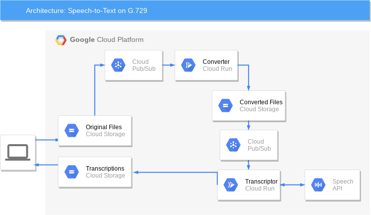

# Google Cloud Speech-to-Text on G.729 encoded files

Run the Google Cloud Speech-to-Text API over G.729 encoded wav files.

How this works:
1. Upload G.729 encoded wav files to a Google Cloud Storage bucket
2. A Pub/Sub notification is sent to the **converter** running in Cloud Run each time a file is uploaded to the bucket
3. The **converter** converts the G.729 file to PCM and stores the converted file into a Google Cloud Storage bucket
4. A Pub/Sub notification is sent to the **transcriptor** running in Cloud Run each time a file is uploaded to the bucket
5. The **transcriptor** runs the Speech-to-Text API and uploads the transcriptions to a Google Cloud Storage bucket in CSV format  
  

## Installation
### Enable the APIs
Enable the Speech-to-Text & Cloud Run APIs:
```
gcloud services enable speech.googleapis.com run.googleapis.com
```
### Create a service account
Create a service account:
```
gcloud iam service-accounts create my-service-account
```
Retreive the service account email:
```
gcloud iam service-accounts list
```
### Create the Google Cloud Storage buckets
Create 3 buckets:
```
gsutil mb -l EUROPE-WEST1 bucket-for-original-audio-files
gsutil mb -l EUROPE-WEST1 bucket-for-converted-audio-files
gsutil mb -l EUROPE-WEST1 bucket-for-transcriptions
```
Grant the service account permission to write to the buckets:
```
gsutil iam ch serviceAccount:my-service-account-email:roles/storage.objectAdmin gs://bucket-for-original-audio-files
gsutil iam ch serviceAccount:my-service-account-email:roles/storage.objectAdmin gs://bucket-for-converted-audio-files
gsutil iam ch serviceAccount:my-service-account-email:roles/storage.objectAdmin gs://bucket-for-transcriptions
```
### Deploy the converter in Cloud Run
Deploy the converter image to Cloud Run:
```
gcloud run deploy converter \
   --image=europe-west1-docker.pkg.dev/mickael-public-share/stt-g729/converter \
   --service-account=my-service-account-email \
   --set-env-vars=DESTINATION_BUCKET=bucket-for-converted-audio-files \
   --region=europe-west1 \
   --no-allow-unauthenticated
```
Grant the service account access to the Cloud Run deployment:
```
gcloud run services add-iam-policy-binding converter \
   --region=europe-west1 \
   --member=serviceAccount:my-service-account-email \
   --role=roles/run.invoker
```
### Deploy the transcriptor in Cloud Run
Deploy the transcriptor image to Cloud Run:
```
gcloud run deploy transcriptor \
   --image=europe-west1-docker.pkg.dev/mickael-public-share/stt-g729/transcriptor \
   --service-account=my-service-account-email \
   --set-env-vars=DESTINATION_BUCKET=bucket-for-transcriptions \
   --region=europe-west1 \
   --no-allow-unauthenticated
```
Grant the service account access to the Cloud Run deployment:
```
gcloud run services add-iam-policy-binding transcriptor \
   --region=europe-west1 \
   --member=serviceAccount:my-service-account-email \
   --role=roles/run.invoker
```
### Create the Pub/Sub topic for original audio files
Create the Pub/Sub topic:
```
gcloud pubsub topics create original-files-topic
```
Create the Pub/Sub subscription:
```
gcloud pubsub subscriptions create original-files-subscription --topic original-files-topic \
   --push-endpoint=converterURL \
   --push-auth-service-account=my-service-account-email
```
Enable Google Cloud Storage notifications:
```
gsutil notification create -t original-files-topic -f json -e OBJECT_FINALIZE gs://bucket-for-original-audio-files
```
### Create the Pub/Sub topic for converted audio files
Create the Pub/Sub topic:
```
gcloud pubsub topics create converted-files-topic
```
Create the Pub/Sub subscription:
```
gcloud pubsub subscriptions create converted-files-subscription --topic converted-files-topic \
   --push-endpoint=transcriptorURL \
   --push-auth-service-account=my-service-account-email
```
Enable Google Cloud Storage notifications:
```
gsutil notification create -t converted-files-topic -f json -e OBJECT_FINALIZE gs://bucket-for-converted-audio-files
```
## Usage
From the Cloud Storage page go to the bucket created for original audio files:  
  
  
  
Create a folder for storing the audio files:  
  
  
  
Name the folder using the BCP-47 code of the source language making sure it is available in the [supported languages](https://cloud.google.com/speech-to-text/docs/languages) for Cloud Speech-to-Text:  
  
  
  
Navigate inside the folder:  
  
 
 
Upload the audio files to be transcripted:  
  
 
  
The converted audio file will be available in the bucket for converted files shortly after the upload:  
  
  
  
The transcription file will be available in the bucket for transcription files shortly after the upload:  
  
 
  
